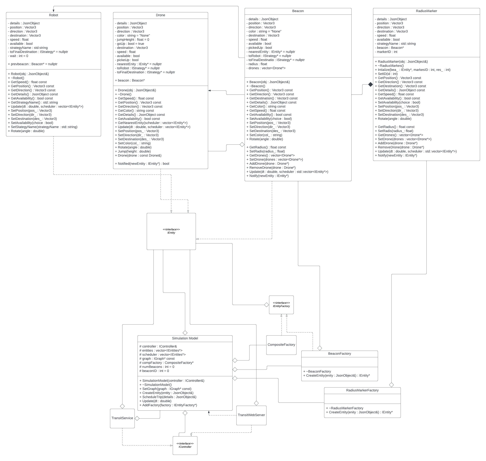

# Team-001-40-homework4
Developed by Jeffrey Do (do000043@umn.edu) and Kris Moe (moe00013@umn.edu)

## Description
This project is an new feature extenstion to the Drone Simulation project for CSCI 3081W Program Design and Development at the University of Minnesota. The project simulates a drone traveling to an available object (which is a robot in this simulation) to a desired location.

The new feature adds beacons to the drone simulation. At each beacon, a drone is assigned to the beacon and can only traverse in the radius of the beacon. As such, to reach a destination the robot will traverse through multiple beacons. The drone will move the robot to the edge where beacons overlap to hand off to next drone until the robot had reached its destination.

The idea of the extension is to simulate an effective range that a drone can travel. The implementation of the extension uses the Observer pattern as its main design pattern.

## Table of Contents
- [Getting Started](#getting-started)
- [Extention Funtionallity](#extention-functionallity)
- [UML](#uml)
- [Youtube Video](#youtube-video)
- [Sprint Retrospective](#sprint-retrospective)
- [Docker](#docker)
- [Credits](#credits)

## Getting Started

Here is a quick overview of how to run the visualization :

    ```bash
    # Go to the project directory
    cd /path/to/repo/project
    
    # Build the project
    make -j
    
    # Run the project (./build/web-app <port> <web folder>)
    ./build/bin/transit_service 8081 apps/transit_service/web/
    ```
    
Navigate to http://127.0.0.1:8081 and you should see a visualization.

Navigate to http://127.0.0.1:8081/schedule.html and you should see a page to schedule the trips.

*Note: 8081 will depends on what port you used. If you use port 8082, then it will be http://127.0.0.1:8082 instead.*

## Extention Functionallity
*What does it do?*

The new extention places a new objects that are called beacons in the simulation. We initalize a new drone to each beacon. Each drone can only move in the area covered in the assigned beacon. In the edge case, where the destination is not covered by any beacon, the robot will attempt to travel to the destination using its selected strategy.

*Why is it significally interesting?*

This is significally interesting because the extenstion simulates an effective range for the drones. As such when a destination is not inrange, it will drop off the drone at the edge of the effective area towards the destination.

*How does it add to the existing work?*

Added beacons to communicate with the drones, drones are now limited to beacons. Drones change color when in transit.

*Which design pattern did you choose to implement it and why?*

The observer pattern is used to create a way for the drones and beacons to communicate with each other. 

*Instruction to use this new feature* 

Our feature is not user interactable. In the simulation, the robot will be visibly picked up and dropped off between drones when traveling.

## UML


## Youtube Video
[Youtube Video](https://youtu.be/RZfkPjS_nZw)

## Sprint Retrospective
What went well during the sprint is that we mangaged to complete the basic functionality in our first sprint. Any issues that were found during development were immediately handeled. Placing the beacons on the map, intializing the drones to beacons, and developing the pathing algoritm are examples of tasks that were completed. During our second sprint we started to test and handle edge cases such as "What happens if the destination is not in any beacon radius?", and "What do we do if there are more drones than beacons and visa versa?". Afterwords we were handeling finishing touches, such as the ReadMe, Documentation, and Cpplint were handeled. Some improvements, or future work could include adding priorty to certain beacons/drones, non-circular area coverage, and adding specialized drop/pick off points. These are some ideas that can be added in future implementations.

## Docker
https://hub.docker.com/repository/docker/do000043/homework4/general

## Credits
The beacon model was taken from https://sketchfab.com/3d-models/radio-tower-from-poly-by-google-268b4970a174419f8d621f469454be84#download
